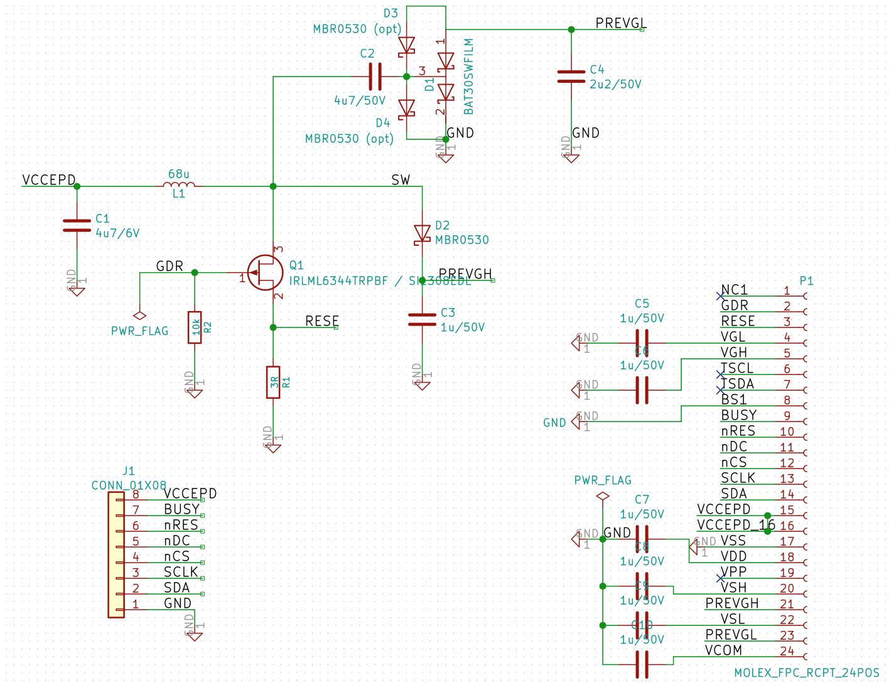
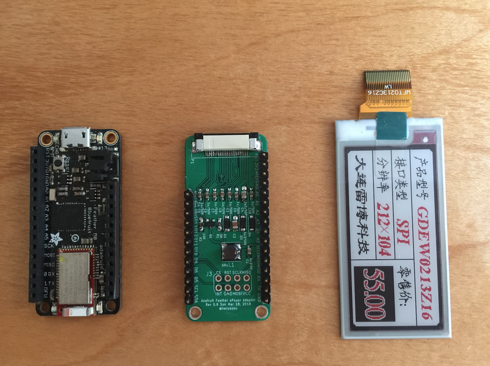
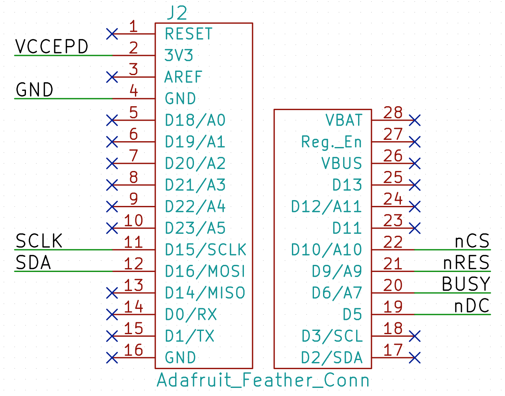
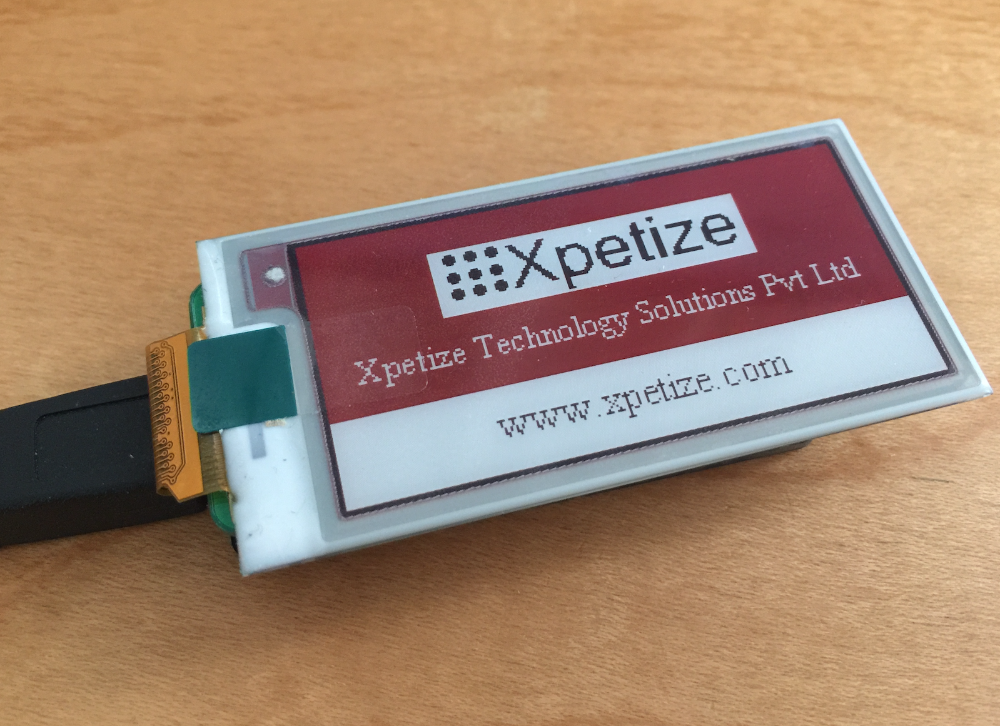

# ePaper Adapters

The shematic in this project was delived from [ESP32 epaper adapter](https://github.com/pcbreflux/espressif/tree/master/esp32/kicad/ESP32-epaper-adapter).

See [full schematic](files/epaper-adapters.pdf) in pdf.

## ePaper Wing for Adafruit Fether

A ePaper adapter compatible with [Adafruit Feather boards](https://www.adafruit.com/feather).

 
